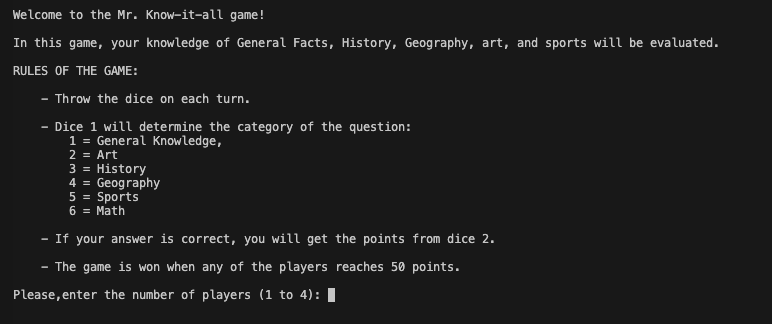
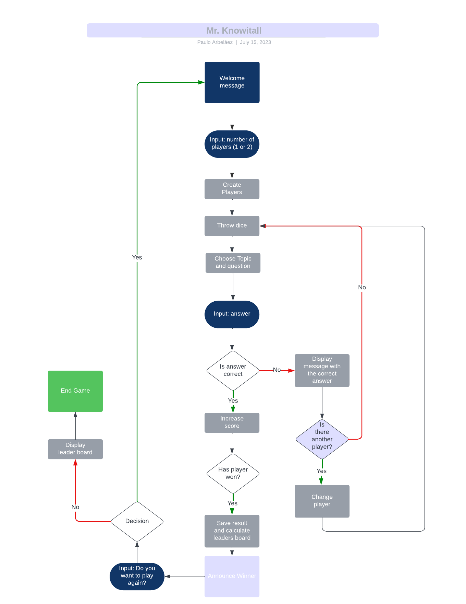
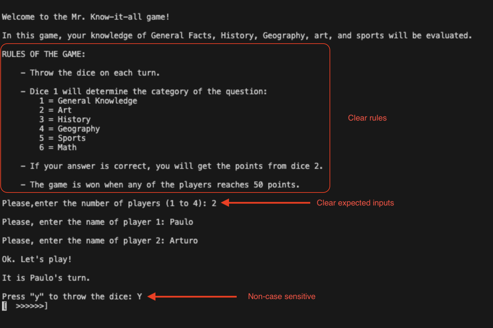
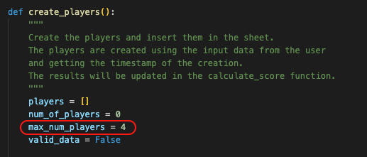
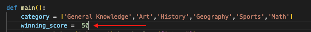
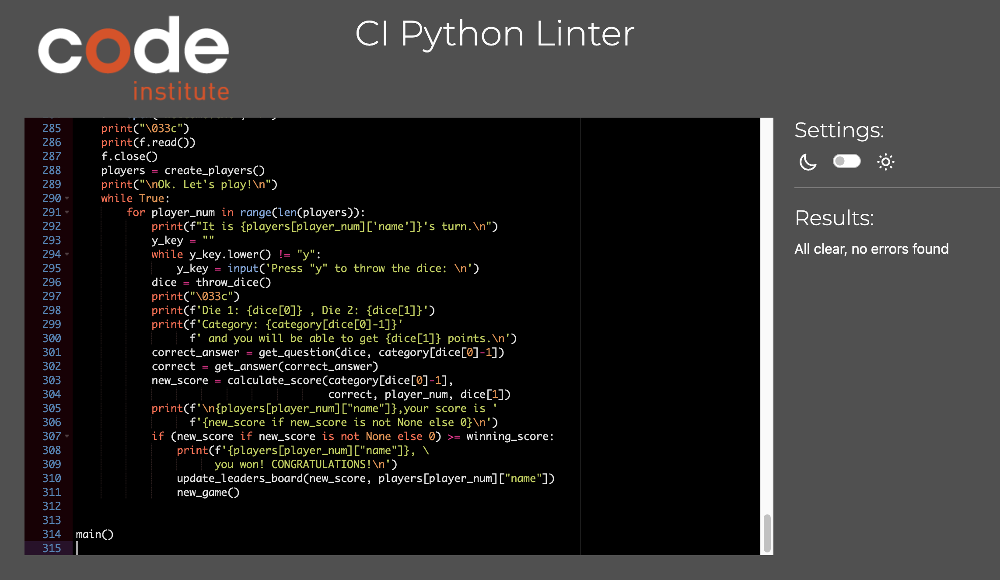

# Mr. Know-it-all Game

## Introduction

Mr. Know-it-all is a trivia game developed in Python in which the player(s) (up to 4) will answer questions on different topics until one of them reaches a specific score (set by the programmer).



## Table of contents

- [Rules of the game](#rules-of-the-game)
- [Design](#design)
- [Flow Chart](#flow-chart)
- [User experience (UX)](#user-experience-ux)
  - [User Stories](#user-stories)
  - [Strategy](#strategy)
    - [User](#user)
      - [Leader board (top n)](#leader-board-top-n)
    - [Administrator](#administrator)
      - [Welcome Message](#welcome-message)
      - [Maximum Number of Players](#maximum-number-of-players-max_num_players)
      - [Increase, decrease, or modify the questions](#increase-decrease-or-modify-the-questions)
      - [Loading animation](#loading-animation)
      - [Winning Score](#winning-score)
- [Exception/Error handling](#exceptionerror-handling)
- [Testing](#testing)
- [Future Improvements](#future-improvements)
- [Deployment, forking, and cloning](#deployment-forking-and-cloning)
  - [Deployment to Heroku](#deployment-to-heroku)
  - [Forking the project](#forking-the-project)
  - [Cloning the project](#cloning-the-project)
- [Credits](#credits)
  - [Code snippets and inspiration](#code-snippets-and-inspiration)
  - [Acknoledgements](#acknoledgements)

## Rules of the game

The players will throw the dice, and die 1 will determine the category:

    1 = General Knowledge
    2 = Art
    3 = History
    4 = Geography
    5 = Sports
    6 = Math

The second die will determine the points that the player will gain if answers correctly.

After each question, the turn will be passed to the next player.

The game will continue until one of the players get the score stated by the programmer in the [Setting the winning score section](#winning-score).

## Design

The design of the game was based on CLI, therefore, one of the goals was to be as clear as possible, so the user would be always aware of how the interaction should take place, namely, what keys or characters should be inserted to play the game and navigate through its segments.

## Flow Chart



## User experience (UX)

### User Stories

- As a player, I want to:
  - Have clear indications on how to play.
  - Have an easy-to-understand UI.
  - Have the expected inputs from my side which are also non-case sensitive.
  - Display a leaders board, so I can know what the top 5 scores are.

- As a Game Administrator (programmer), I want to:
  - Be able to easily modify the question and their quantity.
  - Be able to easily modify the **winning score**.

### Strategy

All stories are based on accessibility, either for the user and the way to interact with the game, or for the programmer and the easiness in modifying the game settings.

#### User

All game stages have explicit instructions, and each time an input is required, the game will clearly state what are the options and will react to them, as shown below:



##### Leader Board (top n)

At the end of each game, the leader board is shown with the top n scores in the recorded history of the game.


#### Administrator

The administrator will have the chance to modify the following parameters and features:

##### Welcome message

The welcome message is stored in the [welcome.txt](./welcome.txt) file.

Any change in this file will be reflected in the welcome message in the terminal.

##### Maximum Number of Players (`max_num_players`)

- Default value = 4

   

   **NOTE:** The sheets file will respond accordingly.

##### Increase, decrease, or modify the questions

It can be done directly in the Google Sheets file. The code is already content agnostic, hence, no modification is needed in the `run.py` file.

The Google Sheets file can grow as much as needed/wanted. The code is already adapted to have as many questions per category as the programmer wants.

<!-- trunk-ignore(markdownlint/MD046) -->
```Python
category_sheet = SHEET.worksheet(category)
nbr_of_rows = len(category_sheet.get_all_values())
question = category_sheet.row_values(random.randint(2,nbr_of_rows - 1))
```

##### Loading animation

For this, it only would be needed to change the sequence list in the `throw_dice` function.

<!-- trunk-ignore(markdownlint/MD040) -->
<!-- trunk-ignore(markdownlint/MD046) -->
```
loading = [
        "[        ]",
        "[>       ]",
        "[>>      ]",
        "[>>>     ]",
        "[>>>>    ]",
        "[>>>>>   ]",
        "[>>>>>>  ]",
        "[>>>>>>> ]",
        "[>>>>>>>>]",
        "[ >>>>>>>]",
        "[  >>>>>>]",
        "[   >>>>>]",
        "[    >>>>]",
        "[     >>>]",
        "[      >>]",
        "[       >]",
        "[        ]",
        "[       <]",
        "[      <<]",
        "[     <<<]",
        "[    <<<<]",
        "[   <<<<<]",
        "[  <<<<<<]",
        "[ <<<<<<<]",
        "[<<<<<<<<]",
        "[<<<<<<< ]",
        "[<<<<<<  ]",
        "[<<<<<   ]",
        "[<<<<    ]",
        "[<<<     ]",
        "[<<      ]",
        "[<       ]"
        ]
```

##### Winning Score

The winning_score variable at the beginning of the main function will set the number of points that a player should get to be declared as the winner.



The programmer can change this value according to his/her needs.

**NOTE:** when changing the winning_score variable, remember to update the [welcome.txt](./welcome.txt) file.

## Exception/Error handling

Error catching was needed in the number of players selection. In this part of the program, the user can enter a number outside the range or even a letter. Therefore, a try/except was included in the `create_players()` function, to avoid crashings due to str to int conversions, and incorrect numbers that top the maximum numbers of players.

For the rest of the code, there was no need of this usage, as the inputs could be any alpha-numeric entries, and the "y/n" questions are controlled with the lower() method and check-up of the correct letter.

## Testing

Using the official pep8 linter for Code Institute, the run.py showed no errors:



Please, refer to the [Testing.md](./testing.md) file.

## Future Improvements

- Make the game feasible to have, instead of a maximum score, a maximum of correctly answered questions.
- Make the game feasible to replicate a graphical board game.

## Technologies used

### Languages

- [Python](https://www.python.org/) - to build all the game functionalities.
- [gspread](https://docs.gspread.org/en/latest/index.html) - library used for the Google Sheets API functionality and data handling.

### Programs and Tools

- [Visual Studio Code](https://code.visualstudio.com/) - the code editor being used to build the project.
- [Git](https://git-scm.com/) - the built-in Git feature in VS Code was used for version control and push to github.
- [Github](https://github.com/) - Github is used to store all project's code.
- [Heroku](https://www.heroku.com/) - deployment platform.

## Deployment, forking and cloning

### Deployment to Heroku

**IMPORTANT:** Before starting with the deployment process, please create a `requirements.txt` file.
In the terminal, run the following command:`pip3 freeze > requirements.txt`, copy the result and paste it into the just created `requirements.txt` file.

1. Log in to [Heroku](https://www.heroku.com/)
2. On top right corner of the screen, locate the `New` button and the choose `Create new app`.
3. Give a unique name to the app, choose the appropriate region and click `Create`.
4. Access your app dashboard and click on `Deploy`.
5. Under `Deployment method`, choose GitHub and connect to the respective repository.
6. Enable automatic deployment (if you want that any code update is also available automatically in your Heroku deployment) and click `Deploy`.
7. Set up environment on Heroku by going to `Settings` tab.
8. On `Config Vars` section, click `Reveal Config Vars`
9. Add the creds.json content to them.
10. Add the PORT with 8000 value as well.
11. On the top right coner of the app's dashboard, locate the button `Open app`. You will be able to see you deployed app with a link to live site.

### Forking the project

Follow these steps to fork this project:

1. Log in to GitHub and navigate to this project's respository: [mr_knowitall](https://github.com/Parbelaez/mr_knowitall).
2. Just above the navigation menu of the repository (above the Settings button), locate the Fork button.
3. The original copy of the repository is now copied to your GitHub account which allows you to view and/or work on the code without affecting the original work.

### Cloning the project

Follow these steps to clone this project:

1. Log in to GitHub and navigate to this project's respository: [mr_knowitall](https://github.com/Parbelaez/mr_knowitall).
2. Under the navigation menu of the repository, locate and click the button "Code" which shows different options to clone or download.
3. To clone this repository using HTTPS, copy the link under "Clone with HTTPS".
4. Open the Git terminal.
5. If needed, change the current workspace to the location where you want the repository to be cloned.
6. Type git clone and paste in the URL copied in step 3 and press Enter.

## Credits

### Code snippets and inspiration

- The dice animation is a variation of the example shown in this Stackoverflow [post](https://stackoverflow.com/questions/7039114/waiting-animation-in-command-prompt-python)

### Acknoledgements

Thanks to my mentor, Jubril Akolade for his continous support and encouragement.
