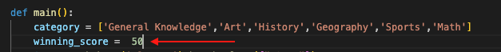

# TESTING

## MANUAL TESTING

### Testing User Stories

`Welcome message, instructions, and leader board`

| Goals | How are they achieved? | Image |
| :--- | :--- | :--- |
| As a player, I want to have clear indications on how to play. | The game starts with a welcome message that includes the description, objective of the game, and rules. Over the course of the game, the user will be prompted for inputs with clear expected characters.|  |
| As a player, I want to have the expected inputs from my side which are also non-case sensitive. | All inputs are non-case sensitive|  |
|As a player, I want have a leaders board, so I can know what the top 5 scores are. | At the end of each game a leader board is displayed and it is updated with each game played | |

`Admin User`

| Goals | How are they achieved? | Image |
| :--- | :--- | :--- |
| Be able to easily modify the question and their quantity. | As the program uses the number of rows counted directly from the Google Sheets file, there is no need to modify anyhting in the `run.py` file | :--- |
| As an admin user, I want to be able to easily modify the winning score. | The admin should only need to change the value of the `winning_score` variable in the `main()` function. |  |

- - -

### Full Testing

Full testing was performed on the following devices:

* Laptop:
  * Macbook Pro 2022 16 inch screen
  * Lenovo Y510pa

Each device tested the site using the following browsers:

* Google Chrome
* Safari
* Firefox
* Edge

**NOTE** the Heroku deployment is not functional in Safari.

Additional testing was taken by friends and family on a variety of devices and screen sizes.

Feature | Expected Outcome | Testing Performed | Result | Pass/Fail |
| --- | --- | --- | --- | --- |
| `Navbar` |
| Site logo | Redirects to the home page | Click logo |  Redirects to home page | Pass |
| Site Name | Redirects to home page | Click site name | Redirects to home page | Pass |
| Home Link | Redirects to home page | Click home link | Redirects to home page | Pass |
| Login Link (user not logged in) | Redirect to Login page | Click log in link | Redirected to log in page | Pass |
| Sign up Link (user not logged in)  | Redirect to Sign up page | Click sign up link | Redirected to sign up page | Pass |
| View all posts link | Redirects the user to the all threads page | Click view all posts link | Redirected to all posts page | Pass |
| Admin View | Redirects to the admin view page | Click admin view link | Redirected to admin view page | Pass |
| Logout link (user logged in) | User will be logged out | Click log out link| Redirected to home page - login link available | Pass |
| `Home Page` |
| View threads button | Redirects to the threads page | Click button | Redirected to the thread | Pass |
| Start a new thread button | Modal popup to create new thread | Click button | New thread modal popped up | Pass |
| `Login Page` |
| Form - link to sign up page | Redirects user to sign in page | Click link | Redirected to sign up page | Pass |
| Form - Submission with no information | User prompted to fill in information | clicked submit button with no fields filled out | Form highlighted first empty field | Pass |
| `Signup Page` |
| Form - Submission with no information | User prompted to fill in information | clicked submit button with no fields filled out | Form highlighted first empty field | Pass |
| `New Post Page` |
| --- | --- | --- | --- | --- |
| `New Thread Page` |
| --- | --- | --- | --- | --- |
| `Threads Page` |
| --- | --- | --- | --- | --- |
| `Admin Posts Page` |
| --- | --- | --- | --- | --- |
| `Privacy Policy Page` |
| Link to Terms & Conditions Page | Redirects user to the Terms & Conditions page | Click link | Redirected to the terms & conditions page | Pass |
| Get Safe Online link | Redirects the user to the get safe online website in a new browser tab | Click link | site opens, but in same browser tab | Fail |
| Link to Rocket Lawyer site in Attribution section | User is taken to the Rocket Lawyer site in a new browser tab | Click link | Rocket Lawyer site opens, but in same tab | Fail |
| `Terms and Conditions Page` |
| Link to Rocket Lawyer site in Attribution section | User is taken to the Rocket Lawyer site in a new browser tab | Click link | 404 page opens | Fail |
| `404 Page` |
| (User Logged in) Home Button | User will be redirected to the home page | Click home button | Redirected to the home page | Pass |
| (Guest User) Login Button | User redirected to the login page | Click login button | Redirected to the login page | Pass |
| (Guest User) Sign Up Button | User redirected to the sign up page | Click sign up button | Redirected to sign up page | Pass |
| `Footer` |
| Footer - Join now button | Redirects user to the sign up page | Click button | Redirected to sign up page | Pass |
| Footer - Social media links | Opens new tab to the social media site | Clicked each icon | New tabs opened for each site | Pass |
| Footer - Privacy Policy link | Redirects to the privacy policy page | Clicked link | Redirected to privacy policy page | Pass |
| footer - Terms and conditions link | Redirects to the terms and conditions page | Clicked link | Redirected to terms and conditions page | Pass |

Back to [README.md](README.md)