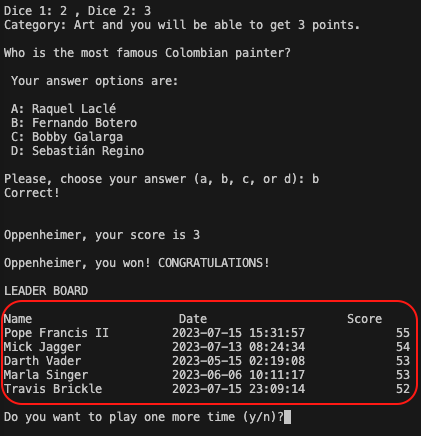

# TESTING

## MANUAL TESTING

### Testing User Stories

`Welcome message, instructions, and leader board`

| Goals | How are they achieved? | Image |
| :--- | :--- | :--- |
| As a player, I want to have clear indications on how to play. | The game starts with a welcome message that includes the description, objective of the game, and rules. Over the course of the game, the user will be prompted for inputs with clear expected characters.|  |
| As a player, I want to have the expected inputs from my side which are also non-case sensitive. | All inputs are non-case sensitive|  |
|As a player, I want have a leaders board, so I can know what the top 5 scores are. | At the end of each game a leader board is displayed and it is updated with each game played | |

`Admin User`

| Goals | How are they achieved? | Image |
| :--- | :--- | :--- |
| Be able to easily modify the question and their quantity. | As the program uses the number of rows counted directly from the Google Sheets file, there is no need to modify anyhting in the `run.py` file | :--- |
| As an admin user, I want to be able to easily modify the winning score. | The admin should only need to change the value of the `winning_score` variable in the `main()` function. |  |

- - -

### Full Testing

Full testing was performed on the following devices:

* Laptop:
  * Macbook Pro 2022 16 inch screen
  * Lenovo Y510pa

Each device tested the site using the following browsers:

* Google Chrome
* Safari
* Firefox
* Edge

**NOTE** the Heroku deployment is not functional in Safari.

Additional testing was taken by friends and family on a variety of devices and screen sizes.

Feature | Expected Outcome | Testing Performed | Result | Pass/Fail |
| --- | --- | --- | --- | --- |
| Try / Except for the number of players | - Any number lower than one should be reject. - Any number greater than the maximum number of users should be rejected. - Any alpha character should be rejected. | Input all the unexpected characters | All were rejected and there was a message displaying the problem, and an invitation to try again.  | Pass |
| Blanks validation and leading-ending spaces for the players names. | - Any name full of blanks should be rejected. - Any leading blank spaces in the name should be deleted. - Any ending blank spaces in the name should be deleted. | Input all the possibilities | All blanks were rejected inviting to enter the name once again, and blank spaces at the beginning or end of the name were deleted.  | Pass |
| Blanks validation and leading-ending spaces for the players names. | - Any name full of blanks should be rejected. - Any leading blank spaces in the name should be deleted. - Any ending blank spaces in the name should be deleted. | Input all the possibilities | All blanks were rejected inviting to enter the name once again, and blank spaces at the beginning or end of the name were deleted.  | Pass |

Back to [README.md](README.md)